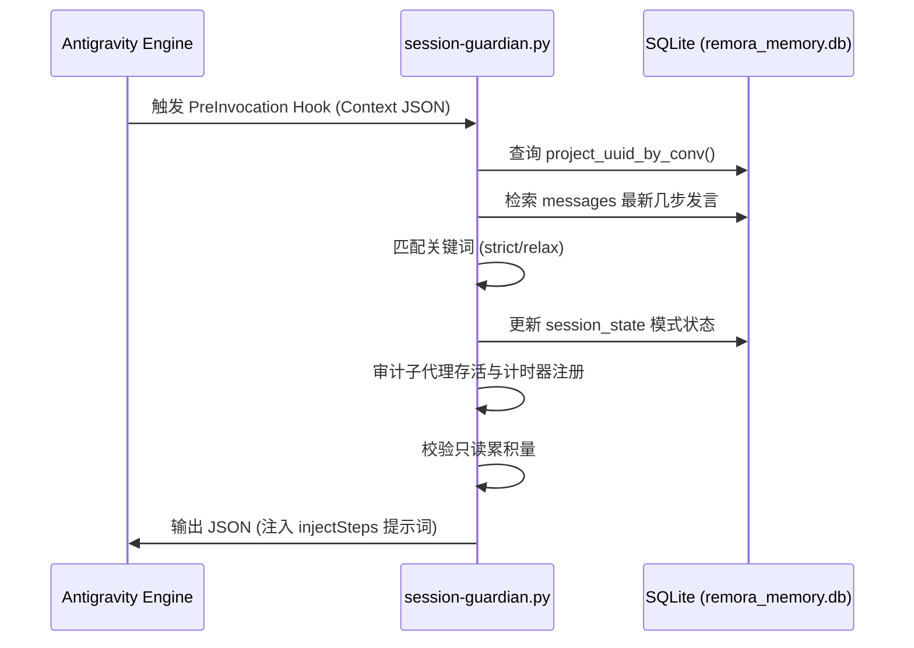
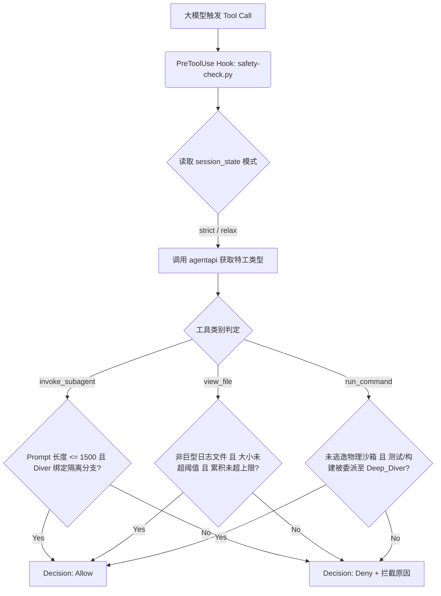
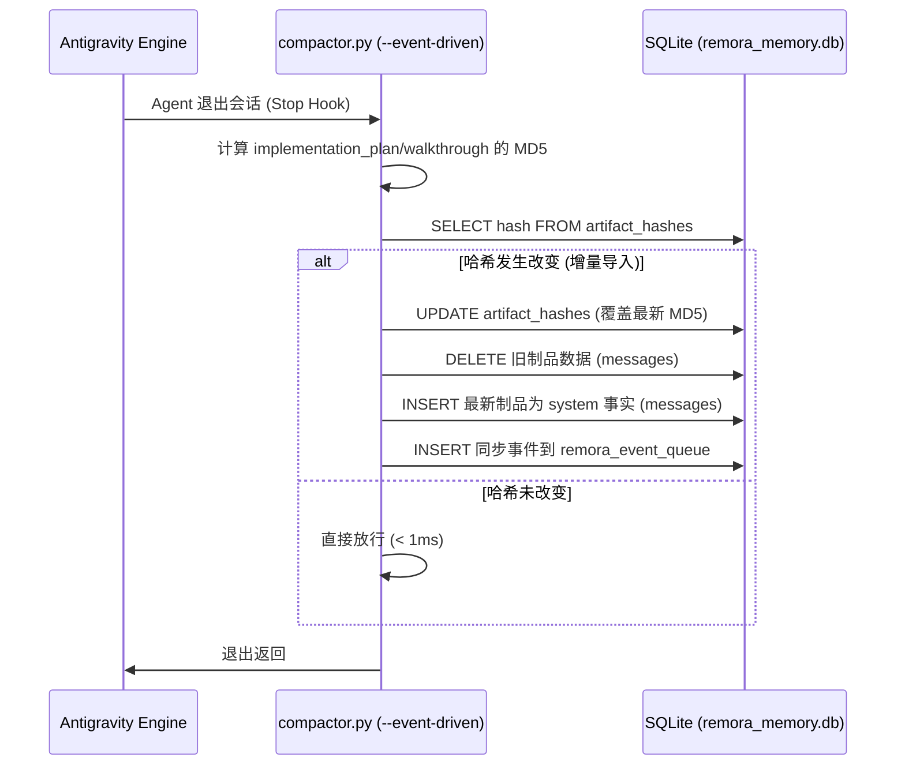
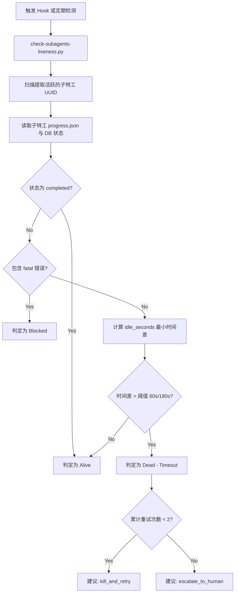
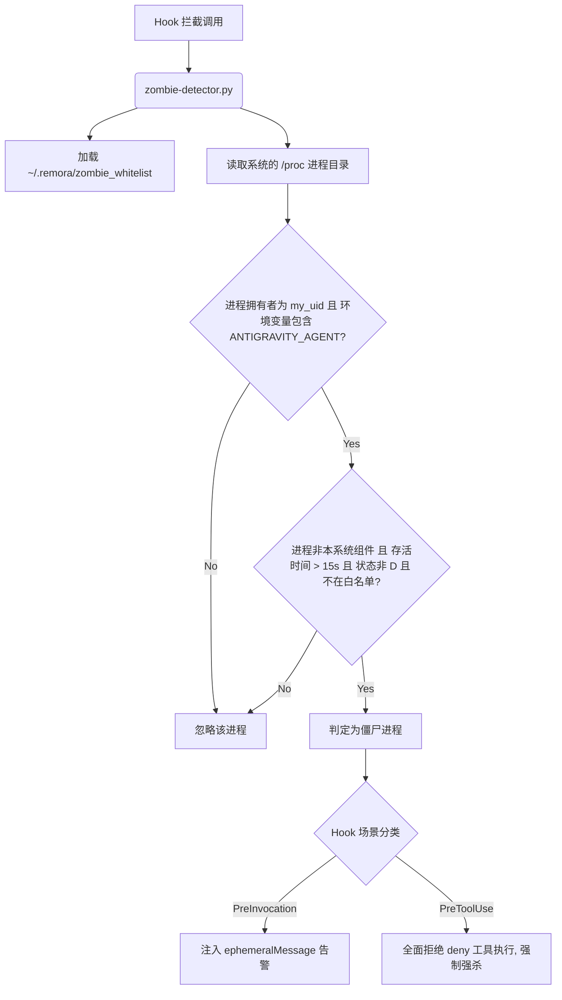
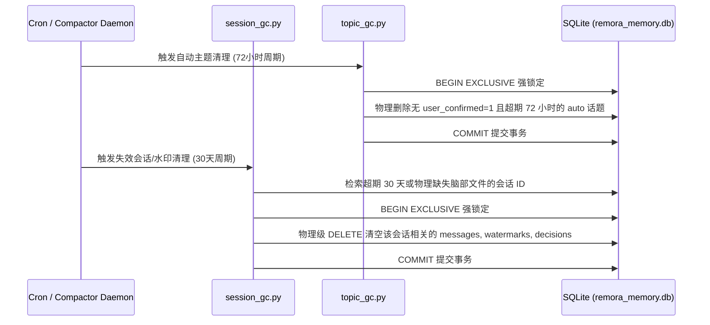
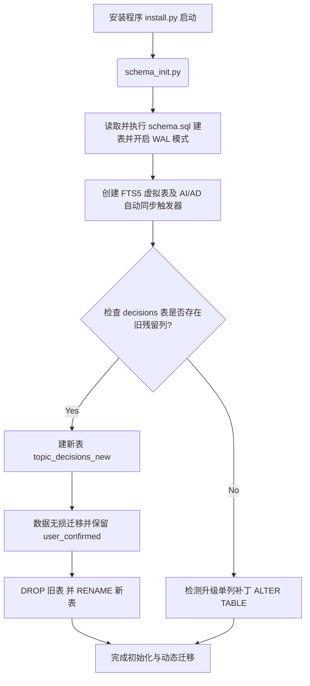
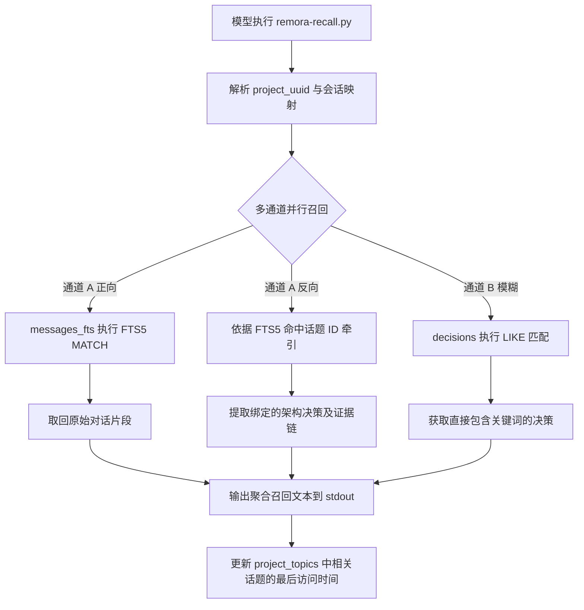
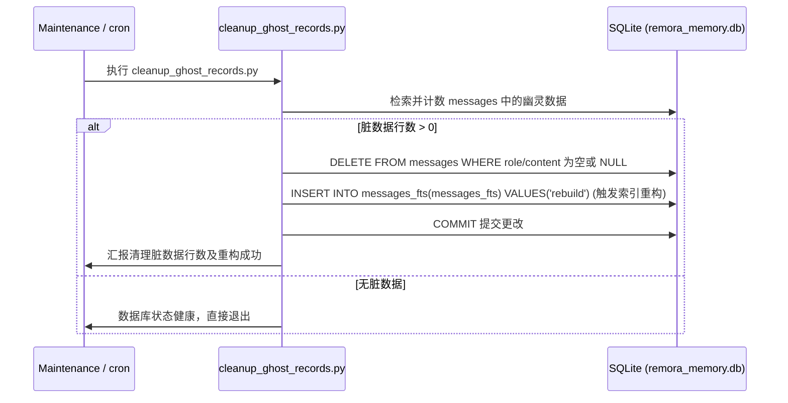
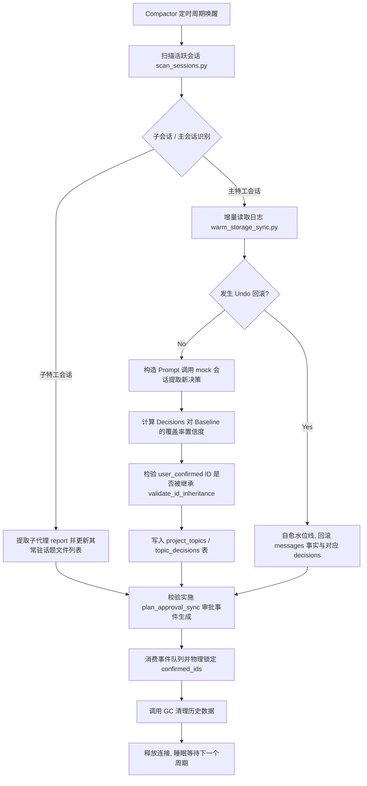

[English](business_flows.md) | [简体中文](business_flows.zh.md)

# Remora Core Business Flows & Low-Level Implementation

This document details the 10 core business flows of the Remora system, covering interceptors, daemons, data management, and background Compactor integration, including their underlying Python/SQL scripts, SQLite table structures/indexes/triggers, relevant API interaction logic, and Mermaid diagrams that illustrate their call chains.

---

## 1. Hooks Interception Flows

### 1. PreInvocation Flow
* **Business Description**: Before the Agent is awakened by input and begins execution, the mounted hook is invoked. It intercepts sessions, determines the current interaction mode (`strict`/`relax`), and injects prompt context to guide the LLM.
* **Underlying Scripts**: `{PLUGIN_ROOT}/adapter/hooks/session-guardian.py` and `{PLUGIN_ROOT}/adapter/hooks/action-gate.py`.
* **SQLite Interaction**:
  * **Tables**:
    * `session_state`: Reads and updates the current session mode (`mode`) and cold-start flag (`is_cold_start`).
    * `messages`: Reads the most recent messages in the session for mode analysis.
    * `watermarks`: Retrieves the project UUID associated with the current session.
  * **Triggers/Indexes**: None.
* **API Interaction Logic**:
  * Reads the JSON-formatted Context from standard input (`stdin`).
  * Caches Language Server credentials to `{PLUGIN_ROOT}/data/.runtime/remora_agent_env.json`, ensuring subagent runtime environment variables are not lost.
  * Returns JSON-formatted `injectSteps` to standard output (`stdout`), injecting `<system-reminder>` prompts into the LLM.
* **Detailed Steps**:
  1. The hook is awakened and verifies whether `{data_dir}/.runtime/installed.flag` exists; if not, it passes through directly.
  2. Reads the context JSON from `stdin`, parsing out the current `conversationId` and recent conversation history.
  3. Queries `watermarks` to get the `project_uuid` bound to the session.
  4. Reads the mode keywords configured in `{PLUGIN_ROOT}/conf/keywords.json` (e.g., `[strict]`, `[relax]`). If the user's message contains a matching keyword, updates the `mode` column in `session_state`.
  5. Audits subagent state. If a subagent is running but its corresponding `schedule` timer is lost, injects `injectSteps` into the LLM guiding it to use `schedule`.
  6. Validates the read-only accumulation counter. If it exceeds thresholds (Source 150KB, Data 50KB), injects a soft-limit warning prompt.
* **Mermaid Flowchart**:


---

### 2. PreToolUse Flow
* **Business Description**: When the LLM attempts to invoke any physical tool (such as `run_command`, `view_file`, `grep_search`, etc.), a security interception is triggered. It primarily performs physical sensitivity checks, file size limits, and permission isolation audits.
* **Underlying Scripts**: `{PLUGIN_ROOT}/adapter/hooks/safety-check.py` and the auxiliary rule engine `{PLUGIN_ROOT}/core/rules/inspector.py`.
* **SQLite Interaction**:
  * **Tables**: `session_state` (queries the session `mode` to determine whether strict or relaxed limits apply).
* **API Interaction Logic**:
  * Reads the `toolCall` context from `stdin`.
  * Invokes the subprocess `agentapi get-conversation-metadata <conv_id>` to detect the agent's `typeName` (e.g., `Remora_ReadOnly_Extractor` or `Remora_Deep_Diver`) in order to apply the corresponding security boundaries.
  * Returns `{"decision": "allow"}` or `{"decision": "deny", "reason": "..."}`.
* **Detailed Steps**:
  1. Loads context from `stdin` and extracts the tool name and parameters from `toolCall`.
  2. Obtains the current agent's `typeName`.
  3. **If calling `invoke_subagent`**:
     * Limits Prompt length to 1500 characters;
     * If the subagent is `Remora_Deep_Diver`, enforces that its `Workspace` isolation parameter must be `branch` or `share`.
  4. **If calling `view_file`**:
     * Prohibits the main agent from directly reading giant log files such as `.jsonl`, `.log`, `.sqlite` (these must be delegated to `Remora_ReadOnly_Extractor`).
     * Limits maximum single-read file size (50KB in `strict` mode, 200KB in `relax` mode).
     * Validates global cumulative read limits (Source 400KB, Data 150KB); denies if exceeded.
  5. **If calling `run_command`**:
     * Intercepts commands like `cat`, `grep`, `jq`, `awk` that directly fetch sensitive logs.
     * Invokes `inspector.py` (the core rule engine) to recursively deconstruct nested shells, performing Base64 decryption and environment variable expansion validation.
     * For heavy physical operations such as compilation (`build`) and testing (`test`), forces delegation to `Remora_Deep_Diver`; the main agent environment refuses to execute them.
  6. **If calling `grep_search`**:
     * Prevents direct scanning of agent-specific metadata directories or giant JSONL log paths.
* **Mermaid Flowchart**:


---

### 3. Stop Flow
* **Business Description**: Executed when the Agent finishes running and transitions to offline/stopped state. It asynchronously harvests artifacts, incrementally imports newly modified Markdown documents into warm storage, and resets the session counter.
* **Underlying Scripts**: `{PLUGIN_ROOT}/scripts/adapter/sidecar/compactor/compactor.py` (with `--event-driven` flag) and `{PLUGIN_ROOT}/adapter/maintenance/clean-session-stats.py`.
* **SQLite Interaction**:
  * **Tables**:
    * `artifact_hashes`: Saves and overwrites MD5 hashes of extracted artifacts to support incremental comparison.
    * `messages`: Inserts artifact content as `system` role facts using the special session ID `artifact_sync_{project_uuid}` (line number range reserved at `999900+`).
    * `project_topics`: Registers the global archive topic `artifact_topic` for artifact synchronization.
    * `remora_event_queue`: Physically pushes sync events (e.g., `walkthrough_sync`).
    * `session_state`: Clears the session's read-only accumulation counters.
  * **Triggers**: The `messages_ai` trigger automatically syncs content to the full-text index virtual table `messages_fts` when writing to `messages`.
* **API Interaction Logic**:
  * Receives the exit-phase context and extracts `artifactDirectoryPath` (the physical path of the artifact directory).
* **Detailed Steps**:
  1. Invokes `clean-session-stats.py` to determine if the system is currently in `fullyIdle` state. If so, resets session transient read limits.
  2. Triggers `compactor.py --event-driven`, harvesting `implementation_plan.md` and `walkthrough.md` from `/artifacts/`.
  3. Computes the MD5 of these two files.
  4. Compares against records in `artifact_hashes`. If unchanged, exits directly; if changed, triggers incremental import:
  5. Physically deletes old artifact data records.
  6. Inserts the latest artifacts as facts into `messages`, specifying `topic_id='artifact_topic'`, with line numbers `999900` (Plan) and `999901` (Walkthrough).
  7. Except for Plan approval which follows independent logic, other successfully changed artifacts trigger a `walkthrough_sync` event inserted into `remora_event_queue` for background asynchronous consumption.
* **Mermaid Flowchart**:


---

## 2. Asynchronous Background Daemon / Sidecar / Cron Flows

### 4. Subagent Heartbeat / Liveness Detection Flow
* **Business Description**: Real-time auditing of subagent execution states spawned by the main agent. When a subagent is stuck or has timed out without updating its heartbeat, it intercepts and provides self-healing retry suggestions to prevent the main agent from timing out due to unresponsiveness.
* **Underlying Scripts**: `{PLUGIN_ROOT}/adapter/sandbox/check-subagents-liveness.py` and `{PLUGIN_ROOT}/adapter/sandbox/subagent-monitor.py`.
* **SQLite Interaction**:
  * **Tables**: `messages` (inspects system messages and error output between the subagent and parent agent).
* **API Interaction Logic**:
  * Reads `.runtime/progress.json` from the subagent's working tree directory.
  * Dynamically determines the timeout threshold based on the type of command the subagent is currently running.
* **Detailed Steps**:
  1. Scans the parent agent's recent conversation steps via regex to extract subagent UUIDs.
  2. Locates each subagent's workspace directory and reads `progress.json`.
  3. **Status Analysis**:
     * If `status` field is `completed`: classified as Alive & successfully completed.
     * If `status` field is `blocked` or logs contain errors like `permission denied`: classified as Blocked.
     * Computes the minimum time delta `idle_seconds` between the `progress.json` update time and the SQLite sub-session's last message write time.
     * If currently executing `run_command`, the stuck timeout threshold is relaxed to 180 seconds; otherwise 60 seconds. If `idle_seconds` exceeds the threshold, classified as `Dead (Timeout)`.
  4. **Self-Healing Suggestions**:
     * Checks and increments the retry count in `{PLUGIN_ROOT}/data/.runtime/remora_subagent_retries/{parent_conv_id}.json`.
     * If cumulative retry count $< 2$: returns `kill_and_retry` suggestion, guiding the LLM to forcefully kill and retry.
     * If cumulative retry count $\ge 2$: returns `escalate_to_human` suggestion, stopping retries and directly reporting to the user.
* **Mermaid Flowchart**:


---

### 5. Zombie Process Detection & Self-Healing Flow
* **Business Description**: When the LLM uses `run_command` to execute background tasks, this flow automatically scans for unmanaged or stuck spawned background processes (e.g., un-exited Node.js, Python processes) and forces the LLM to clean them up, ensuring system physical security.
* **Underlying Scripts**: `{PLUGIN_ROOT}/adapter/hooks/zombie-detector.py`.
* **SQLite Interaction**: None.
* **API Interaction Logic**:
  * Injects an `ephemeralMessage` warning during the `PreInvocation` phase.
  * During the `PreToolUse` phase, directly `deny`s subsequent tool execution until the zombie processes are cleaned up.
* **Detailed Steps**:
  1. Obtains the current agent's physical UID (`my_uid`) and current parent PID.
  2. Loads `~/.remora/zombie_whitelist`, cleaning up invalidated PIDs.
  3. Traverses the `/proc/` directory:
     * Filters out non-numeric directories, excludes the current process's own PID;
     * Filters out processes not owned by the current agent;
     * Reads `/proc/<pid>/environ`, checking for the presence of `ANTIGRAVITY_AGENT=` (i.e., processes spawned from the agent environment);
     * Reads `/proc/<pid>/stat`, obtaining the process state and computing actual uptime. If uptime $> 15.0$ seconds, classified as an unsupervised persistent process;
     * Reads `/proc/<pid>/cmdline`, filtering against the whitelist (excluding Compactor and other Remora components).
  4. If unsupervised zombie processes are found and not in the whitelist:
     * Throws an explicit error warning at the hook, blocking the LLM from invoking other physical tools until the LLM physically calls `manage_task(kill)` to terminate the background task.
* **Mermaid Flowchart**:


---

### 6. Session / Topic Garbage Collection Flow
* **Business Description**: Automatically runs during Compactor background daemon periodic polling, responsible for cleaning up expired, inactive, or user-unconfirmed auto-generated topics and session facts, controlling warm storage database size.
* **Underlying Scripts**: `{PLUGIN_ROOT}/scripts/adapter/sidecar/compactor/compactor.py` (in daemon mode), specifically comprising `{PLUGIN_ROOT}/adapter/maintenance/session_gc.py` and `{PLUGIN_ROOT}/adapter/maintenance/topic_gc.py`.
* **SQLite Interaction**:
  * **Tables**:
    * `project_topics`: Physical `DELETE`.
    * `topic_decisions`: Associated physical `DELETE`.
    * `watermarks`: `DELETE` watermarks for invalidated sessions.
    * `messages`: Deletes messages under recycled sessions.
  * **Locking Mode**: Uses strong `BEGIN EXCLUSIVE` transaction-level write locks to avoid lock escalation conflicts with foreground hooks.
* **API Interaction Logic**: No external API interaction; purely local warm storage database archival and cleanup logic.
* **Detailed Steps**:
  1. **Topic Garbage Collection (`topic_gc.py`)**:
     * Starts a strong exclusive lock transaction `BEGIN EXCLUSIVE`.
     * Queries `project_topics` for all topics satisfying the following conditions:
       1. Source is auto-extracted: `source='auto'`;
       2. Status is closed: `status='closed'`;
       3. Contains no user-confirmed decisions in `topic_decisions` (`user_confirmed = 1`);
       4. Topic last accessed is earlier than 72 hours ago: `last_accessed_at < datetime('now', '-72 hours')`.
     * Physically deletes the corresponding `topic_decisions` entries and removes the `project_topics` topic records.
  2. **Session Garbage Collection (`session_gc.py`)**:
     * Retrieves sessions from `watermarks` whose last active time is earlier than 30 days ago, or that are marked in `session_state` as physically lost/deleted.
     * Verifies that their physical brain-split directories have been removed.
     * Once conditions are met, starts a `BEGIN EXCLUSIVE` transaction and deletes the session's related data from `watermarks`, `messages`, and `topic_decisions`.
* **Mermaid Flowchart**:


---

## 3. Data Management Flows

### 7. Database Schema Initialization / Migration Flow
* **Business Description**: Automatically triggers table creation and migration upon project deployment, plugin installation via `install.py`, or database schema upgrades.
* **Underlying Scripts**: `{PLUGIN_ROOT}/scripts/schema/schema_init.py` and the schema declaration script `{PLUGIN_ROOT}/scripts/schema/schema.sql`.
* **SQLite Interaction**:
  * **Tables**: Creates or modifies 9 core entity tables and virtual tables.
  * **Triggers**: Automatically creates FTS5-related `messages_ai` (insert sync) and `messages_ad` (delete sync) triggers.
  * **FTS5 Virtual Table**: Creates the `messages_fts` virtual table with the `trigram` tokenizer.
* **API Interaction Logic**:
  * Opens the database connection using `sqlite3.connect(..., timeout=15)` and executes DDL.
* **Detailed Steps**:
  1. Reads and executes `schema.sql`, and configures high-performance PRAGMA parameters:
     * `PRAGMA journal_mode=WAL;` (enables Write-Ahead Logging for improved concurrent read/write performance).
     * `PRAGMA synchronous=NORMAL;` (optimizes write-disk sync latency).
  2. **Dynamic Migration Detection**:
     * Detects the `user_confirmed` column in `topic_decisions`; if missing, automatically executes `ALTER TABLE` to appends it.
     * Detects new columns in `project_topics` such as `source`, `last_accessed_at`, etc.; if missing, self-heals by appending them.
  3. **Phase 34 Table Restructure & Data Migration**:
     * Validates whether `topic_decisions` contains deprecated redundant columns. If so, creates a `topic_decisions_new` table, losslessly copies old table data, then `DROP`s the old table and `RENAME TO` the new one.
     * Similarly, completes the `watermarks` table rename restructure, discarding the `last_line_processed` field for structural simplification.
* **Mermaid Flowchart**:


---

### 8. History Recall / Retrieval Flow
* **Business Description**: When the LLM or system needs to retrieve historical experience and architectural decisions, implements a hybrid recall based on three channels (FTS5 forward, decision reverse tracing, LIKE fuzzy matching).
* **Underlying Scripts**: CLI recall tool `{PLUGIN_ROOT}/adapter/cli/remora-recall.py` and the underlying `{PLUGIN_ROOT}/lib/dao.py`.
* **SQLite Interaction**:
  * **Tables**: `messages` (reads plaintext data), `messages_fts` (uses trigram for MATCH full-text search), `topic_decisions` (extracts decision content and evidence source text), `project_topics` (updates the last-accessed time of touched topics).
  * **Full-Text Index Query**: `JOIN messages_fts fts ON m.id = fts.rowid WHERE fts.content MATCH ...`
* **API Interaction Logic**:
  * CLI arguments support passing search keywords and project UUID.
  * Outputs formatted recall content directly to terminal `stdout`.
* **Detailed Steps**:
  1. Accepts keywords and performs SQL escaping to prevent injection vulnerabilities.
  2. Obtains the project UUID. If absent, reverse-looks up the bound `project_uuid` from the `watermarks` table using the current session ID.
  3. **Recall Channel A (FTS5 Forward Raw Log Retrieval)**:
     * Performs full-text search on `messages_fts`, joining matched results with `messages` to retrieve original conversation fragments.
  4. **Recall Channel A Reverse Tracing (Associated Architectural Decision Retrieval)**:
     * Using the `topic_id` of FTS5-matched messages, reverse-extracts bound decisions, rationales, and referenced evidence line fragments from `topic_decisions`.
  5. **Recall Channel B (Direct Architectural Decision Matching)**:
     * Performs `LIKE` fuzzy matching on the `decision` and `rationale` columns of `topic_decisions`.
  6. **Self-Healing Touch Refresh**:
     * If match count $> 0$, updates the `last_accessed_at` timestamp of all matched topics to the current time, preventing premature GC cleanup.
* **Mermaid Flowchart**:


---

### 9. Active Topic Management Flow
* **Business Description**: During LLM-driven development, allows explicit tool-based management of the current development topic (Topic), supporting creation, one-click active state switching, archival, as well as final physical confirmation of decisions and multi-sandbox code merging.
* **Underlying Scripts**: Topic management tool `{PLUGIN_ROOT}/adapter/cli/remora-topic.py` and `{PLUGIN_ROOT}/adapter/sandbox/sandbox-merge.py`.
* **SQLite Interaction**:
  * **Tables**:
    * `project_topics`: Creates, closes, and modifies physically associated files.
    * `topic_decisions`: Marks `user_confirmed=1` to confirm decisions, promoting the associated topic to `manual`.
    * `session_state`: Sets the cold-start flag `is_cold_start=1`, signaling the hook to perform an environment reload on the next request.
* **API Interaction Logic**:
  * Supports CLI actions: `new`, `switch`, `close`, `confirm`.
  * Invokes the subprocess `{PLUGIN_ROOT}/adapter/sandbox/sandbox-merge.py <subagent_id>` to handle physical code changes produced by isolated agents and perform Git-level automatic merging.
* **Detailed Steps**:
  1. **Create (`new`)**: Calls `create_or_update_topic`, inserts a topic record with `status='open'` and `source='manual'` in `project_topics`, and sets `is_cold_start` to 1 in `session_state`.
  2. **Switch (`switch`)**: Sets all other topics under the project to `closed`, updates the target topic as the sole `open` state, and writes the cold-start signal.
  3. **Close/Archive (`close`)**: Updates the specified topic status to `closed`, forces the source type to `manual` to prevent automatic topic GC cleanup.
  4. **Confirm & Sandbox Physical Merge (`confirm`)**:
     * Updates the `user_confirmed` flag to 1 for the specified `decision_id`.
     * Promotes the associated topic to `manual` level.
     * Runs the subprocess `{PLUGIN_ROOT}/adapter/sandbox/sandbox-merge.py <subagent_id>`:
       1. Extracts the temporary branch name from the subagent's worktree.
       2. Computes the list of files physically modified by the subagent in its isolated sandbox (`git diff --name-only`).
       3. Executes `git merge` to perform conflict-free merging of the isolated branch code.
     * Captures the output `[PHYSICAL_CHANGES]` file list, and uses a SQLite strong exclusive lock transaction to call `dao.merge_physical_files_to_topic`, appending the changed file names as a JSON array into the topic's associated `associated_files` column, achieving precise decision-to-file mapping.
* **Mermaid Flowchart**:
```mermaid
flowchart TD
    A[调用 remora-topic.py confirm -d <id>] --> B[更新 decisions 中 user_confirmed = 1]
    B --> C[更新关联话题为 manual 防止 GC 回收]
    C --> D[检索并获取最新的子代理 worktree 目录]
    
    D --> E[执行 sandbox-merge.py 获取临时分支名]
    E --> F[执行 git diff 计算沙箱物理修改文件列表]
    F --> G[物理执行 git merge 将子代理代码合并入主工程]
    
    G --> H[捕获输出的 PHYSICAL_CHANGES 列表]
    H --> I[调用 merge_physical_files_to_topic() 将文件追加写入 SQLite]
```

---

### 10. Ghost Record Periodic Cleanup Flow
* **Business Description**: Cleans up "ghost records" — records with empty `role` or `content` fields that may arise from extreme edge cases such as network disconnections or abnormal session termination — ensuring FTS full-text index search quality and retrieval accuracy.
* **Underlying Scripts**: Maintenance script `{PLUGIN_ROOT}/adapter/maintenance/cleanup_ghost_records.py`.
* **SQLite Interaction**:
  * **Tables**: `messages` (searches for and physically deletes rows with empty role/content fields).
  * **FTS5 Maintenance**: Invokes the SQLite FTS5 rebuild command: `INSERT INTO messages_fts(messages_fts) VALUES('rebuild')` to forcefully rebuild the full-text index.
* **API Interaction Logic**: Local database cleanup; no external API required.
* **Detailed Steps**:
  1. Opens a SQLite connection with write lock and executes a count query:
     `SELECT COUNT(*) FROM messages WHERE role IS NULL OR role = '' OR content IS NULL OR content = ''`.
  2. If the count $> 0$, performs physical cleanup:
     `DELETE FROM messages WHERE role IS NULL OR role = '' OR content IS NULL OR content = ''`.
  3. **Rebuilds the FTS Full-Text Index**:
     * To maintain ultimate physical consistency of the full-text index table `messages_fts`, issues a `rebuild` command to the virtual table.
     * SQLite clears the old dirty token index blocks and, based on the cleaned `messages` table content, reconstructs the trigram full-text inverted index via streaming re-slicing.
  4. Commits the transaction, completing database shrinkage and cleanup.
* **Mermaid Flowchart**:


---

## 4. Core Background Compactor Service Integration Mechanism

The major flows described above are ultimately integrated and driven through `{PLUGIN_ROOT}/scripts/adapter/sidecar/compactor/compactor.py`.
In **Daemon background-mount** mode, the Compactor's business chain runs in the following streaming steps:



These 10 business flows and the background Compactor service complement each other, collectively providing the Remora plugin with a robust, automated, and highly fault-tolerant warm memory network of technical architecture assets. They enable environmental self-healing (Undo detection), data defense (FTS5 full-text indexing), physical security isolation (PreToolUse safety rules), and proactive integration of code assets (Sandbox-merge scheme).
