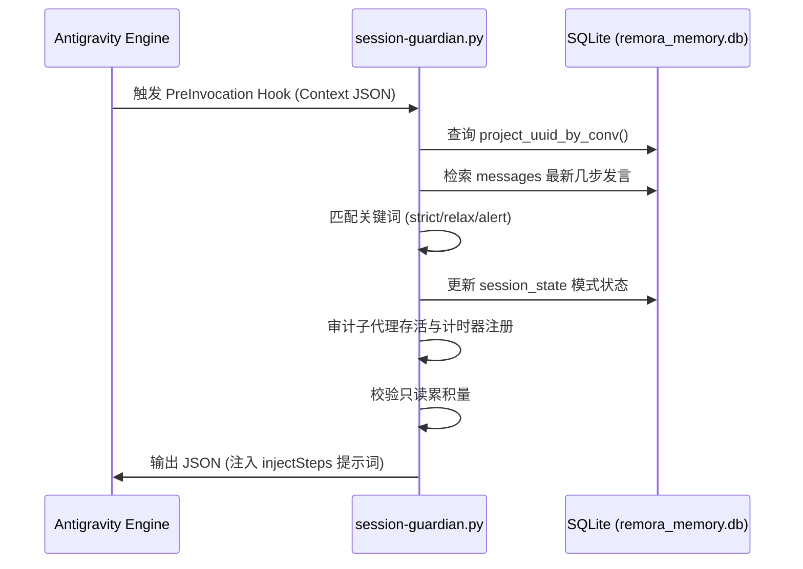
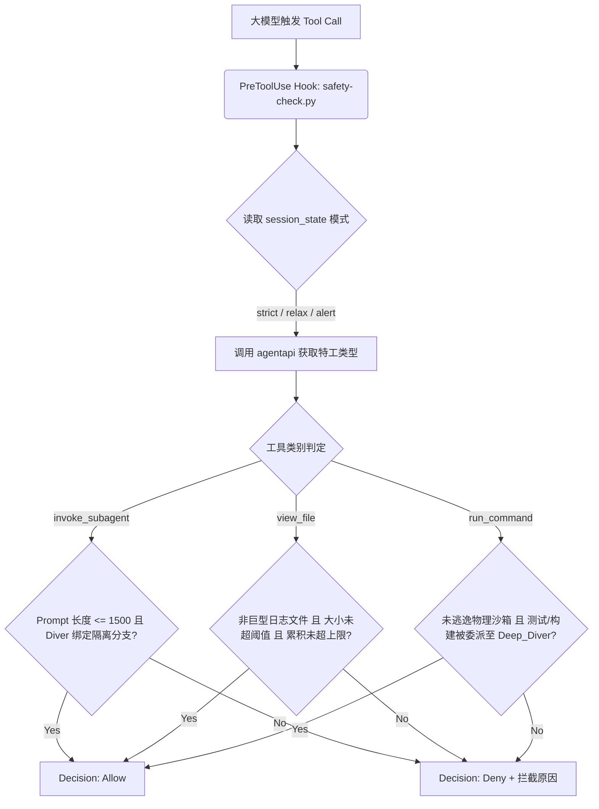
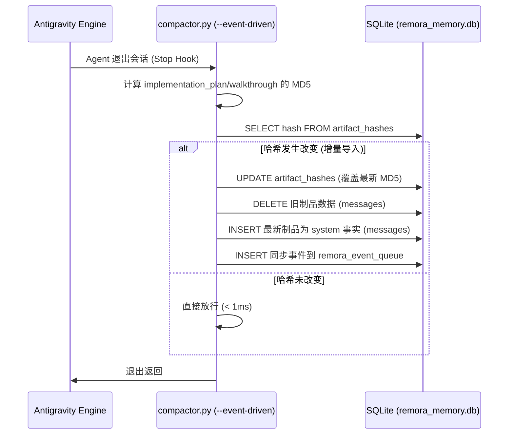
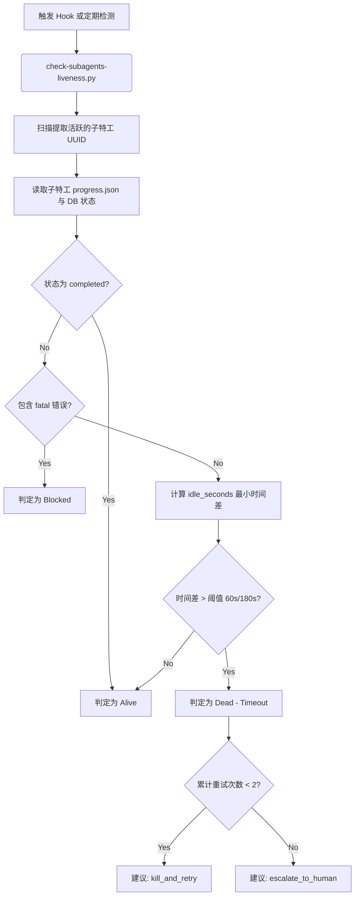
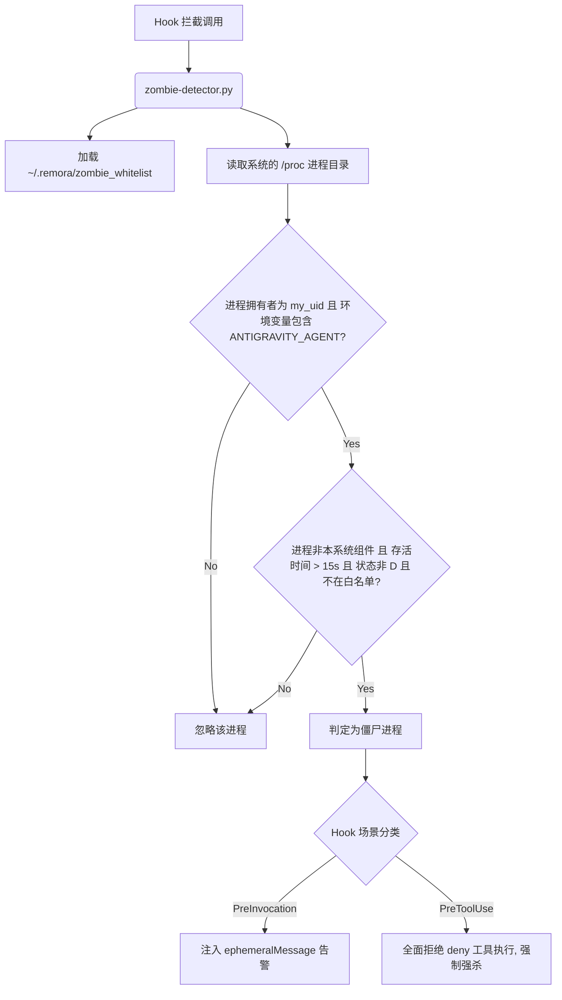
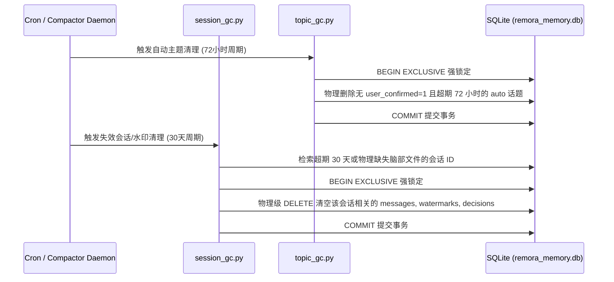
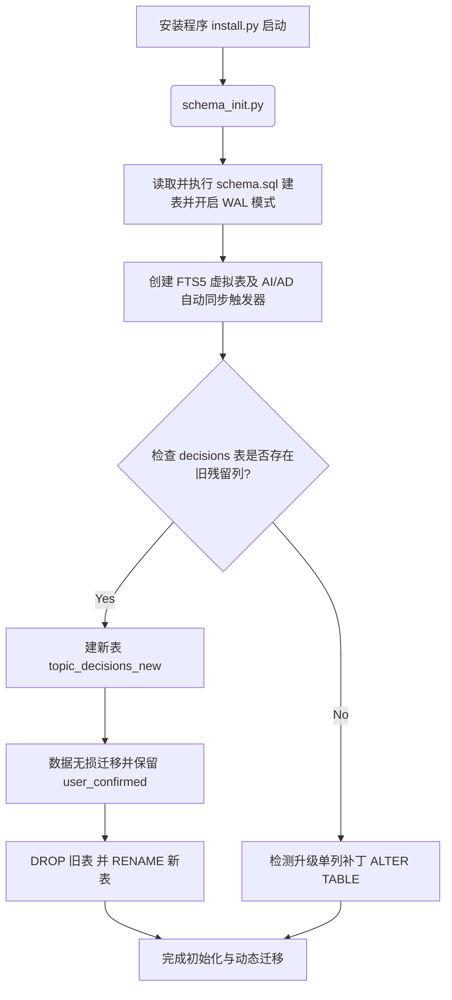
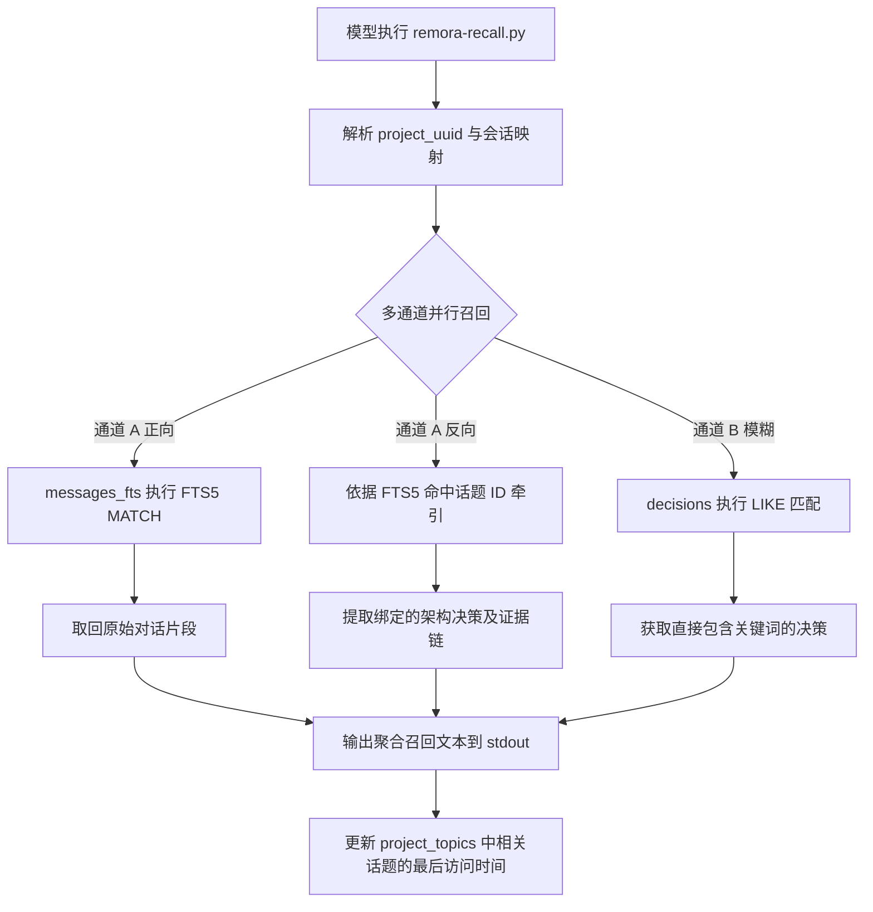
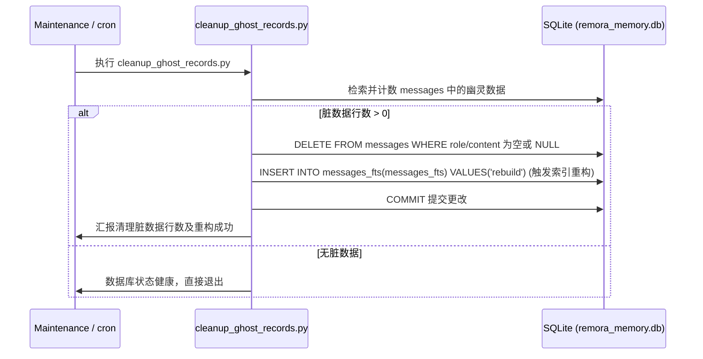
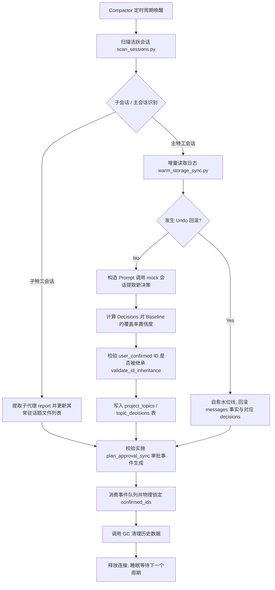

[English](business_flows.md) | [简体中文](business_flows.zh.md)

# Remora 核心业务流程与底层实现

本文件详细记录了 Remora 系统的 10 个核心业务流程，覆盖拦截器、守护进程、数据管理以及后台 Compactor 集成，包括其底层 Python 脚本/SQL 脚本、SQLite 表结构/索引/触发器、相关 API 交互逻辑，并用 Mermaid 流程图展示了它们的调用链。

---

## 一、 Hooks 拦截器流程 (Interception Flows)

### 1. PreInvocation 流程
* **业务描述**：在 Agent 被输入唤醒并开始执行前，挂载的钩子被调用。用于拦截会话、判定当前的交互模式（`strict`/`relax`/`alert`）并注入提示词上下文以引导大模型。
* **底层脚本**：`{PLUGIN_ROOT}/adapter/hooks/session-guardian.py`、`{PLUGIN_ROOT}/adapter/hooks/action-gate.py` 与 `{PLUGIN_ROOT}/adapter/hooks/snapshot-git.py`。
* **SQLite 交互**：
  * **表**：
    * `session_state`：读取和更新当前会话模式（`mode`）和冷启动标记（`is_cold_start`）。
    * `messages`：读取会话的最近几步发言，进行模式分析。
    * `watermarks`：获取当前会话关联的项目 UUID。
  * **触发器/索引**：无。
* **API 交互逻辑**：
  * 从标准输入（`stdin`）读取 JSON 格式的 Context。
  * 将 Language Server 凭证缓存到 `{PLUGIN_ROOT}/data/.runtime/remora_agent_env.json`，确保子特工运行时环境变量不丢失。
  * 向标准输出（`stdout`）返回 JSON 格式的 `injectSteps`，向大模型注入 `<system-reminder>` 提示词。
* **详细步骤**：
  1. 拦截器被唤醒，验证 `{data_dir}/.runtime/installed.flag` 是否存在，若不存在则直接放行。
  2. 从 `stdin` 读取上下文 JSON，解析出当前 `conversationId` 和最近的对话历史。
  3. 查询 `watermarks` 获取会话对应的 `project_uuid`。
  4. 读取 `{PLUGIN_ROOT}/conf/keywords.json` 中配置的模式词（如 `[strict]`、`[relax]`、`[alert]`）。若用户发言中包含对应词，则更新 `session_state` 的 `mode` 列。
  5. 审计子特工状态，如果子特工正在运行且对应的 `schedule` 计时器丢失，则向大模型注入引导使用 `schedule` 的 `injectSteps`。
   6. 校验只读累积量，若超过阈值（Source 150KB，Data 50KB），注入超限软警告提示词。
   7. **冷启动决策注入：** 若 `is_cold_start=1`，从当前项目活跃话题中注入 `uc=0`（未确认）和 `uc=1`（用户已确认）决策作为 `<system-reminder>` 上下文，确保大模型无需显式召回即可立即获得架构感知。
   8. **步距召回注入：** 在 `strict` 模式下，每 N 轮对话自动注入一批来自 `topic_decisions` 的近期话题决策作为隐式召回提示词，在长会话中维持架构对齐。此功能由 `conf/features.json` 开关控制。
   9. **警觉强制召回：** 当用户消息中检测到 Line C 警觉关键词（由 `conf/approval.json` 定义）时，强制注入 `topic_decisions` 中所有匹配决策及其证据摘录，覆盖正常召回门控逻辑。
* **Mermaid 流程图**：


---

### 2. PreToolUse 流程
* **业务描述**：当大模型试图调用任何物理工具（如 `run_command`、`view_file`、`grep_search` 等）前，触发安全拦截。主要执行物理敏感度、文件大小限制和权限隔离审计。
* **底层脚本**：`{PLUGIN_ROOT}/adapter/hooks/safety-check.py` 与辅助规则库 `{PLUGIN_ROOT}/core/rules/inspector.py`。
* **SQLite 交互**：
  * **表**：`session_state`（查询会话的 `mode` 以判断是启用严格限制还是宽松限制）。
* **API 交互逻辑**：
  * 从 `stdin` 读取 `toolCall` 上下文。
  * 调用子进程 `agentapi get-conversation-metadata <conv_id>` 探测特工的 `typeName`（如 `Remora_ReadOnly_Extractor` 或 `Remora_Deep_Diver`）以实施对应的安全边界。
  * 返回 `{"decision": "allow"}` 或 `{"decision": "deny", "reason": "..."}`。
* **详细步骤**：
  1. 从 `stdin` 加载上下文，提取 `toolCall` 中的工具名与参数。
  2. 获取当前特工的 `typeName`。
  3. **若调用 `invoke_subagent`**：
     * 限制 Prompt 长度在 1500 字符以内；
     * 若子特工为 `Remora_Deep_Diver`，则强制其 `Workspace` 隔离参数必须为 `branch` 或 `share`。
  4. **若调用 `view_file`**：
     * 禁止主特工直接读取 `.jsonl`, `.log`, `.sqlite` 等巨型日志文件（此类只能被委派到 `Remora_ReadOnly_Extractor`）。
     * 限制单次读取文件大小上限（`strict` 模式下 50KB，`relax` 模式下 200KB）。
     * 校验全局累积读取限制（Source 400KB，Data 150KB），超限则拒绝。
  5. **若调用 `run_command`**：
     * 拦截直接拉取敏感日志的 `cat`, `grep`, `jq`, `awk` 等命令。
      * 调用 `inspector.py`（核心规则引擎）递归解构 nested shell，进行 Base64 解密和环境变量展开校验。
     * 对编译（`build`）和测试（`test`）等繁重物理行为强制委派至 `Remora_Deep_Diver`，主特工环境拒绝执行。
  6. **若调用 `grep_search`**：
     * 阻止直接扫描特工专属元数据目录或巨型 JSONL 日志路径。
* **Mermaid 流程图**：


### 2.1 cognitive-push PreToolUse 子流程
* **业务描述**：一个次级 PreToolUse 拦截器，当写入操作发生时，为 LLM 上下文注入文件触碰和语义冲突感知。
* **底层脚本**：`{PLUGIN_ROOT}/adapter/hooks/cognitive-push.py`。
* **SQLite 交互**：
  * **表**：`topic_decisions`（通过 `get_decisions_by_file` 读取决策）、`project_topics`、`artifacts`（用于语义冲突扫描）。
  * **配置开关**：由 `{PLUGIN_ROOT}/conf/features.json` 控制。
* **详细步骤**：
  1. **写入门控（首次拒绝，二次允许）：** 首次执行带写入副作用的 `run_command` 时，拦截器拒绝执行并注入提醒提示词，列出与目标文件相关的过往决策。
  2. **文件触碰注入：** 二次写入尝试（或首次 `view_file` 访问）时，调用 `get_decisions_by_file()` 将目标文件路径关联的决策注入 `<system-reminder>`，丰富 LLM 的架构推理上下文。
  3. **Line C 语义冲突检测：** 扫描当前话题决策与 `artifacts` 表之间的语义冲突（如 plan 与 walkthrough 的不一致）。此功能由 `conf/features.json` 中的 `semantic_conflict_detection` 开关控制。检测到冲突时，在正常的文件触碰提示外额外发出 `AlertViolated` 注入步骤。

---


### 3. Stop 流程
* **业务描述**：当 Agent 运行结束并退回离线状态时执行。用于异步搜刮制品，将新修改的 Markdown 文档增量导入温存储，并重置会话计数器。
* **底层脚本**：`{PLUGIN_ROOT}/scripts/adapter/sidecar/compactor/compactor.py`（带 `--event-driven` 参数）与 `{PLUGIN_ROOT}/adapter/maintenance/clean-session-stats.py`。
* **SQLite 交互**：
  * **表**：
    * `artifact_hashes`：保存和覆盖被提取制品的 MD5 哈希以支持增量比较。
    * `messages`：将制品内容作为 `system` 角色事实，使用特殊的会话 ID `artifact_sync_{project_uuid}` 插入（行号段预留为 `999900+`）。
    * `project_topics`：为制品同步注册全局归档话题 `artifact_topic`。
    * `remora_event_queue`：物理抛入同步事件（如 `walkthrough_sync`）。
    * `session_state`：清除会话相关的只读累积量。
  * **触发器**：`messages_ai` 触发器会在写入 `messages` 时，自动将内容同步至全文索引虚拟表 `messages_fts`。
* **API 交互逻辑**：
  * 接收退出阶段上下文，提取 `artifactDirectoryPath`（制品物理目录路径）。
* **详细步骤**：
  1. 调用 `clean-session-stats.py` 判定当前是否已处于 `fullyIdle` 状态。若是，重置会话临时读限制。
  2. 触发 `compactor.py --event-driven`，搜刮 `/artifacts/` 下的 `implementation_plan.md` 和 `walkthrough.md`。
  3. 计算这两个文件的 MD5。
  4. 比对 `artifact_hashes` 中的记录。若无变化，直接退出；若发生变化，则触发增量导入：
  5. 物理删除旧的制品数据记录。
  6. 插入最新制品作为事实到 `messages`，指定 `topic_id='artifact_topic'`，行号为 `999900`（Plan）及 `999901`（Walkthrough）。
   7. 除 Plan 审批走独立逻辑外，其他成功变更的制品会在 `remora_event_queue` 中插入一条 `walkthrough_sync` 事件，供后台异步消费。
   8. **淘汰未确认决策：** 当同一话题下产生 `user_confirmed=1` 的决策时，Compactor 调用 `supersede_unconfirmed` 将旧有的 `uc=0` 同级决策标记为已淘汰，防止温存储索引中积累过期的自动提取决策。
* **Mermaid 流程图**：


---

## 二、 异步后台守护进程/心跳流程 (Daemon / Sidecar / Cron Flows)

### 4. 子特工心跳/活体检测流程
* **业务描述**：实时审计由主特工派生的子特工（Subagents）执行状态，当子特工卡死或超时未更新心跳时，进行拦截并提供自愈重试建议，防止主特工无响应超时。
* **底层脚本**：`{PLUGIN_ROOT}/adapter/sandbox/check-subagents-liveness.py`、`{PLUGIN_ROOT}/adapter/sandbox/subagent-monitor.py` 与 `{PLUGIN_ROOT}/core/liveness.py`（提供 `judge_zombie` 和 `suggest_zombie_action`）。
* **SQLite 交互**：
  * **表**：`messages`（检测子特工和父特工之间的系统消息与错误输出）。
* **API 交互逻辑**：
  * 读取子特工工作树目录下的 `.runtime/progress.json`。
  * 根据子特工当前运行的命令类型动态判定超时阈值。
* **详细步骤**：
  1. 通过正则表达式扫描父特工最近的会话步骤，提取子特工 UUID。
  2. 定位到各子特工工作空间目录，读取 `progress.json`。
  3. **状态分析**：
     * 若 `status` 字段为 `completed`：判定存活且已成功结束。
     * 若 `status` 字段为 `blocked` 或日志中捕获到 `permission denied` 等错误：标记为 Blocked。
     * 计算 `progress.json` 更新时间与 SQLite 子会话最后消息写入时间的最小时间差 `idle_seconds`。
     * 若正在执行 `run_command`，超时卡死阈值放宽至 180 秒，否则为 60 秒。若 `idle_seconds` 超过阈值，由 `core/liveness.py` 的 `judge_zombie()` 判定子代理为 `Dead (Timeout)`。
   4. **自愈建议（通过 `core/liveness.py` 中的 `suggest_zombie_action()`）：**
     * 检查并累加 `{PLUGIN_ROOT}/data/.runtime/remora_subagent_retries/{parent_conv_id}.json` 中的重试次数。
     * 若累计重试次数 $< 2$：向父特工返回 `kill_and_retry` 建议，引导大模型强杀并重试。
     * 若累计重试次数 $\ge 2$：返回 `escalate_to_human` 建议，停止重试，直接上报用户。
* **Mermaid 流程图**：


---

### 5. 僵尸进程检测与自愈流程
* **业务描述**：当大模型使用 `run_command` 执行后台任务时，该流程自动扫描未托管或卡死的衍生后台进程（如未退出的 Node.js, Python 进程），强制大模型清理，确保系统物理安全。
* **底层脚本**：`{PLUGIN_ROOT}/adapter/hooks/zombie-detector.py`。
* **SQLite 交互**：无。
* **API 交互逻辑**：
  * 在 `PreInvocation` 阶段注入 ephemeralMessage 告警。
  * 在 `PreToolUse` 阶段直接 `deny` 拦截后续工具执行，直到僵尸进程被清理。
* **详细步骤**：
  1. 获取当前特工的物理 UID（`my_uid`）和当前的父 PID。
  2. 加载 `~/.remora/zombie_whitelist`，清理已失效的 PID。
  3. 遍历 `/proc/` 目录：
     * 过滤非数字目录，排除当前进程自身的 PID；
     * 过滤非当前特工拥有的进程；
     * 读取 `/proc/<pid>/environ`，查找是否包含 `ANTIGRAVITY_AGENT=`（即特工环境衍生出的进程）；
     * 读取 `/proc/<pid>/stat`，获取进程状态，并计算实际存活时间。若存活时间 $> 15.0$ 秒，判定为无人监管的常驻进程；
     * 读取 `/proc/<pid>/cmdline`，过滤白名单（排除 Compactor 等 Remora 组件）。
  4. 若发现未托管的僵尸进程且不在白名单内：
     * 在 Hook 处抛出明确的错误警告，阻止大模型调用其他物理工具，直至大模型物理调用 `manage_task(kill)` 结束该后台任务。
* **Mermaid 流程图**：


---

### 6. 会话/主题垃圾回收流程
* **业务描述**：Compactor 后台守护进程定期轮询时自动运行，负责清理超期的、不活跃的或无用户确认的自动生成话题和会话事实，控制温存储数据库的体积。
* **底层脚本**：`{PLUGIN_ROOT}/scripts/adapter/sidecar/compactor/compactor.py`（在守护进程模式下），具体包含 `{PLUGIN_ROOT}/adapter/maintenance/session_gc.py` 与 `{PLUGIN_ROOT}/adapter/maintenance/topic_gc.py`。
* **SQLite 交互**：
  * **表**：
    * `project_topics`：物理级 `DELETE`。
    * `topic_decisions`：关联物理级 `DELETE`。
    * `watermarks`：对失效会话的水印进行 `DELETE`。
    * `messages`：删除被回收会话下的发言。
  * **锁定模式**：采用强 `BEGIN EXCLUSIVE` 事务级写锁，避免与前台 Hook 发生锁升级冲突。
* **API 交互逻辑**：无外部 API 交互，纯本地温存储数据库归档清理逻辑。
* **详细步骤**：
  1. **主题垃圾清理 (`topic_gc.py`)**：
     * 启动强排他锁事务 `BEGIN EXCLUSIVE`。
     * 查询 `project_topics` 中所有满足以下条件的话题：
       1. 来源为自动提取：`source='auto'`；
       2. 状态已关闭：`status='closed'`；
       3. 在 `topic_decisions` 中不包含任何已经被用户物理确认的决策（`user_confirmed = 1`）；
       4. 话题最后更新时间早于 72 小时前：`last_accessed_at < datetime('now', '-72 hours')`。
     * 物理删除对应的 `topic_decisions` 条目，并删除 `project_topics` 话题记录。
  2. **会话垃圾清理 (`session_gc.py`)**：
     * 检索 `watermarks` 中最后活跃时间早于 30 天前，或者在系统 `session_state` 中标记为物理丢失/删除的会话。
     * 验证其物理脑裂目录是否已被移除。
     * 满足条件后启动 `BEGIN EXCLUSIVE` 事务，删除 `watermarks`、`messages` 和 `topic_decisions` 中该会话的相关数据。
* **Mermaid 流程图**：


---

## 三、 数据管理流程 (Data Management Flows)

### 7. 数据库结构初始化/迁移流程
* **业务描述**：在项目部署、通过 `install.py` 安装插件或数据库结构升级时，自动触发库表建制和迁移。
* **底层脚本**：`{PLUGIN_ROOT}/scripts/schema/schema_init.py` 与表结构声明脚本 `{PLUGIN_ROOT}/scripts/schema/schema.sql`。
* **SQLite 交互**：
  * **表**：创建或修改 9 张核心实体表及虚拟表。
  * **触发器**：自动创建 FTS5 相关的 `messages_ai`（插入同步）和 `messages_ad`（删除同步）触发器。
  * **FTS5 虚拟表**：创建 `messages_fts` 虚拟表，指定分词器为 `trigram`。
* **API 交互逻辑**：
  * 使用 `sqlite3.connect(..., timeout=15)` 打开数据库连接，并执行 DDL。
* **详细步骤**：
  1. 读取并运行 `schema.sql`，并配置高性能运行参数 PRAGMA：
     * `PRAGMA journal_mode=WAL;`（启用预写日志，提升并发读写性能）。
     * `PRAGMA synchronous=NORMAL;`（优化写盘同步延迟）。
  2. **动态迁移检测**：
     * 检测 `topic_decisions` 中的 `user_confirmed` 字段，若缺失则自动执行 `ALTER TABLE` 物理追加。
     * 检测 `project_topics` 中的 `source`, `last_accessed_at` 等新字段，若缺失则自愈追加。
  3. **Phase 34 表重构与数据迁移**：
     * 校验 `topic_decisions` 列是否包含过期冗余列。若包含，创建 `topic_decisions_new` 表，将旧表数据进行无损复制，完成后 `DROP` 旧表，并 `RENAME TO` 重新映射。
     * 同理，完成 `watermarks` 表的重命名重构，舍弃 `last_line_processed` 字段，实现结构轻量化。
* **Mermaid 流程图**：


---

### 8. 历史回忆召回流程
* **业务描述**：当大模型或系统需要检索历史经验与架构决策时，实现基于三通道（FTS5 正向、决策反向牵引、LIKE 模糊匹配）的混合召回。
* **底层脚本**：命令行回忆工具 `{PLUGIN_ROOT}/adapter/cli/remora-recall.py` 及底层 `{PLUGIN_ROOT}/lib/dao.py`。
* **SQLite 交互**：
  * **表**：`messages`（读取明文数据）、`messages_fts`（利用 trigram 做 MATCH 全文检索）、`topic_decisions`（提取决策内容与证据原文）、`project_topics`（更新被触碰的活跃时间）。
  * **全文索引查询**：`JOIN messages_fts fts ON m.id = fts.rowid WHERE fts.content MATCH ...`
* **API 交互逻辑**：
  * 命令行参数支持传入检索关键词和项目 UUID。
  * 将格式化的召回内容直接输出到终端 `stdout`。
* **详细步骤**：
  1. 输入关键词并进行 SQL 转义，避免注入漏洞。
  2. 获取项目 UUID。若缺失，以当前会话 ID 在 `watermarks` 表中反向检索出绑定的 `project_uuid`。
  3. **召回通道 A（FTS5 原始日志正向召回）**：
     * 全文搜索检索 `messages_fts`，将匹配成功的内容与 `messages` 关联，取出原始对话片段。
  4. **召回通道 A 反向牵引（关联架构决策召回）**：
     * 以 FTS5 命中的消息的 `topic_id` 为目标，反向提取 `topic_decisions` 中与这些话题绑定的已存决策、合理性依据及引用的证据行原文片段。
  5. **召回通道 B（直接匹配架构决策）**：
     * 对 `topic_decisions` 的 `decision` 和 `rationale` 列执行 `LIKE` 模糊匹配。
   6. **自愈加热触碰**：
       * 若匹配数 $> 0$，将命中的所有话题的 `last_accessed_at` 时间戳更新为当前时间，避免其近期被 GC 垃圾清理回收。
   7. **自动步距召回注入：** 在 `strict` 模式下，会话守护者每 N 轮对话自动触发 `remora-recall.py`（步距召回），将一批精选的近期话题决策作为 `<system-reminder>` 提示词注入 LLM 上下文，确保持续的架构对齐，无需 LLM 显式调用召回。
   8. **警觉触发强制召回：** 当用户消息包含 Line C 警觉关键词（由 `conf/approval.json` 定义）时，拦截器绕过正常召回门控，强制立即全面召回所有匹配决策及其证据摘录，在提示词上下文中提高架构优先级。
* **Mermaid 流程图**：


---

### 9. 活跃主题管理流程
* **业务描述**：在大模型开发过程中，允许通过工具显式地管理当前开发的主题（Topic），支持新建、一键式活跃状态切换、归档以及对决策的最终物理确认与多沙箱代码合并。
* **底层脚本**：主题管理工具 `{PLUGIN_ROOT}/adapter/cli/remora-topic.py` 与 `{PLUGIN_ROOT}/adapter/sandbox/sandbox-merge.py`。
* **SQLite 交互**：
  * **表**：
    * `project_topics`：创建、关闭与修改物理关联文件。
    * `topic_decisions`：标记 `user_confirmed=1` 确认决策，晋升关联话题为 `manual`。
    * `session_state`：置冷启动标记 `is_cold_start=1` 信号，告知拦截器下一次请求执行环境重载。
* **API 交互逻辑**：
  * 支持 CLI 动作：`new`、`switch`、`close`、`confirm`。
  * 调用子进程执行 `{PLUGIN_ROOT}/adapter/sandbox/sandbox-merge.py <subagent_id>` 来处理被分离特工产生的物理代码变更，并执行 Git 级自动合并。
* **详细步骤**：
  1. **新建 (`new`)**：调用 `create_or_update_topic`，在 `project_topics` 插入状态为 `open`、来源 `source='manual'` 的主题记录，并将 `session_state` 中的 `is_cold_start` 设为 1。
  2. **切换 (`switch`)**：将本项目下的其他话题置为 `closed`，把目标主题更新为唯一的 `open` 状态，写入冷启动信号。
  3. **关闭归档 (`close`)**：更新指定话题状态为 `closed`，强制提升来源类型为 `manual`，防止被自动主题 GC 清理。
  4. **确认打标并沙箱物理合并 (`confirm`)**：
     * 更新指定 `decision_id` 对应的 `user_confirmed` 标记为 1。
     * 将关联话题提升为 `manual` 级别。
     * 运行子进程 `{PLUGIN_ROOT}/adapter/sandbox/sandbox-merge.py <subagent_id>`：
       1. 提取子特工工作树所在临时分支名。
       2. 计算该子特工在独立沙箱中实际物理修改的文件列表（`git diff --name-only`）。
       3. 执行 `git merge` 无冲突合并该隔离分支代码。
     * 抓取输出的 `[PHYSICAL_CHANGES]` 文件列表，利用 SQLite 强排他锁事务调用 `dao.merge_physical_files_to_topic`，将变动的文件名以 JSON 数组形式追加并整合进该话题关联文件 `associated_files` 列中，实现决策-文件的精准映射。
* **Mermaid 流程图**：
```mermaid
flowchart TD
    A[调用 remora-topic.py confirm -d <id>] --> B[更新 decisions 中 user_confirmed = 1]
    B --> C[更新关联话题为 manual 防止 GC 回收]
    C --> D[检索并获取最新的子代理 worktree 目录]
    
    D --> E[执行 sandbox-merge.py 获取临时分支名]
    E --> F[执行 git diff 计算沙箱物理修改文件列表]
    F --> G[物理执行 git merge 将子代理代码合并入主工程]
    
    G --> H[捕获输出的 PHYSICAL_CHANGES 列表]
    H --> I[调用 merge_physical_files_to_topic() 将文件追加写入 SQLite]
```

---

### 10. 脏数据定期清洗流程
* **业务描述**：清除由于网络断连、会话异常终止等极端边界情况下可能产生的 role 或 content 为空的 "幽灵记录" (Ghost Records)，保证 FTS 全文索引的搜索质量与检索正确率。
* **底层脚本**：维护脚本 `{PLUGIN_ROOT}/adapter/maintenance/cleanup_ghost_records.py`。
* **SQLite 交互**：
  * **表**：`messages`（检索并物理删除 role/content 字段为空的数据）。
  * **FTS5 维护**：调用 SQLite FTS5 重建命令：`INSERT INTO messages_fts(messages_fts) VALUES('rebuild')` 强制重构全文索引。
* **API 交互逻辑**：本地数据库清理，无需外部 API。
* **详细步骤**：
  1. 通过 SQLite 连接，开启写锁定，执行统计：
     `SELECT COUNT(*) FROM messages WHERE role IS NULL OR role = '' OR content IS NULL OR content = ''`。
  2. 若统计计数 $> 0$，调用物理清理：
     `DELETE FROM messages WHERE role IS NULL OR role = '' OR content IS NULL OR content = ''`。
  3. **重构 FTS 全文检索索引**：
     * 为保持全文索引表 `messages_fts` 的最终物理一致性，对虚拟表发出 `rebuild` 重建指令。
     * SQLite 会清除旧的分词脏索引块，按照清理后的最新 `messages` 表内容，流式重新切片构建 trigram 全文倒排索引。
  4. 提交事务，完成数据库的收缩与清洁。
* **Mermaid 流程图**：


---

## 四、 核心后台 Compactor 服务集成机制

上面介绍的各大流程，最终通过 `{PLUGIN_ROOT}/scripts/adapter/sidecar/compactor/compactor.py` 进行整合与驱动。
在 **Daemon 后台挂载** 模式下，Compactor 的业务链按如下步骤流式运行：



这 10 个业务流程与后台 Compactor 服务相辅相成，共同为 Remora 插件提供了鲁棒的、自动化的、且具有高度容错性的技术架构资产温记忆网络，实现了环境自愈（Undo 检测）、数据防守（FTS5 全文索引）、物理安全隔离（PreToolUse 安全规则）以及代码资产的主动整合（Sandbox-merge 合并方案）。
